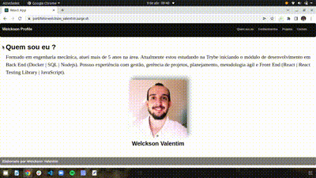

# Boas vindas ao Projeto do meu Portfólio!

Aqui você vai encontrar mais informações sobre minha trajetória profissional, as tecnologias, softwares e stacks que atuei e atuo, alguns dos projetos que desenvolvi durante minha evolução acadêmica e canais de comunicação para entrar em contato.

## Funcionalidades da aplicação

Com esta aplicação podemos visualizar quatro páginas distintas: quem sou eu, conhecimentos, projetos e contatos.
* Para a página quem sou eu, foi descrito de forma resumida algumas informações a meu respeito e inserido uma foto pessoal.
* Para a página conhecimentos, tem-se de forma visual as principais tecnologias e stacks aprendidas e desenvolvidas ao longo da formação como desenvolvedor full stack.
* Para a página projetos, esta inserido o projeto full stack cars, uma aplicação desenvolvida com frontend, backend e banco de dados para a exibição de lista de veículos.
* Para a página contados, tem-se as principais formas de contato e encontrar mais informações a respeito da minha trajetória profissional.

### Tecnologias utilizadas

Aplicação desenvolvida com `React.js`, `javascript`, `html` criando rotas para cada página á ser acessada.
Estilização da página desenvolvida para responsividade ao tamanho da tela, 
desenvolvida em `Bootstrap`.

### Acesso ao Deploy do projeto

Para esta aplicação, foi realizado o deploy utilizando a plataforma Surge.sh.
A aplicação esta disponível no link abaixo.
https://portifolio-welckson_valentim.surge.sh/

### Ilustração da aplicação em funcionamento

# Instruções caso deseje utilizar o projeto localmente
1. Clone o repositório, com o comando:
- `git clone git@github.com:WelcksonValentim-Turma15-TriboB/welckson-valentim-portifolio.git`.

2. Entre na pasta do repositório que você acabou de clonar:
- `cd welckson-valentim-portifolio`

3. Instale as dependências e inicialize o projeto:
- `npm install`

4. Inicialize o projeto:
- `npm start`